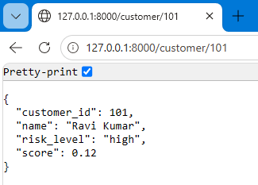
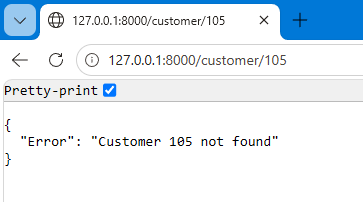
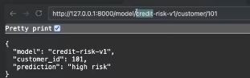
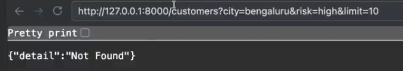
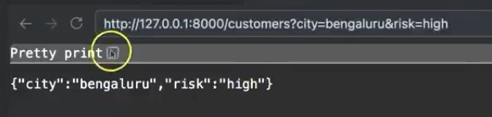
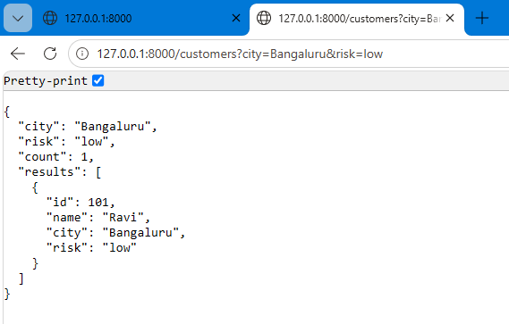

# Phase 3 Path & Query Parameter.

- Till now we have did things having a problem, all the things are doing the same thing for all the persons.
- Like if we make a endpoing like **Predict** the same endpoint predict or work with same logic for everyone.
- But what if we want to find the customer with the 
    1. nubmer 102, 
    2. or we ask for the all the prediction for the mumbai city.
    3. or find the 10 customers data which having salary more than 50000.
- So, above we can see that every request we are creating is different for each and everyone. for the same endpoint.

<span style = color:#800020> Path and Query specific parameter is the thing by which a specific detail we can give and call the function. </span>

- Means we can customize our api request. without making different different endpoint for all. and we can run all the things on the same endpoint.

### Where this thing is spcially useful ?

- Assume that we have creating a model and deployed it.

1. In the company its using for the "Loan Team". for getting data related to the loan for the individuals.
2. "Analytics team" wants to use the all customers "risk level" for a specific city or multiple city.
3. "Management team" wants to use the model for knowing about the top 5 highest risk customers.

- But without the parameter we have to create the separate endpoint for each work.

**Example:-** Assume that we are having 4 story building and want to acess the 304 room number so we will access building first then the floor and then the room number. "/building/floor/304". same for 305 we just need to change the "/building/floor/305"

and we do that with the <span style = color:red> {}, can see done in the "path_query.py".</span>

**`path_parameter.py`**

```python
from fastapi import FastAPI

app = FastAPI()

customer_risk_profiles = {
    101:{"name":"Ravi Kumar", "risk":"high", "score": 0.12},
    102:{"name":"shubham Kumar", "risk":"medium", "score": 0.54},
    103:{"name":"kailash Kumar", "risk":"low", "score": 0.89},
}

@app.get("/customer/{customer_id}")
def get_customer_risk(customer_id: int):
    if customer_id not in customer_risk_profiles:
        return {"Error" : f"Customer {customer_id} not found"}

    profile = customer_risk_profiles[customer_id]

    return {
        "customer_id":customer_id,
        "name": profile["name"],
        "risk_level":profile["risk"],
        "score":profile["score"]
    }

```






### for example if we are doing a specific model prediction.

- In the "path_parameter" append.

```python
# for passing the model. or prdicting with the model.

@app.get("/model/{model_name}/customer/{customer_id}")
def get_model_prediction(model_name: str, customer_id: int):
    return {
        "model": model_name,
        "customer_id": customer_id,
        "prediction": "high risk"       
    }
```



- for runinng a code.

```
uvicorn path_parameter:app --reload
```


## Query Parameter.

- What we pass at the end of the url with the "?".
- here query means we are not changing our path but we are giving any additional information.



**path_parameter.py**

```python
# Query Demonstration.
@app.get("/customers")
def get_customers(city: str, risk: str):
    return {"city": city, "risk":risk}
```

- Here it will see that we haven't write it inside the "{}" so that it will treat it as the question mark part or like a **Query**



**`query_parameter.py`**

```python
from fastapi import FastAPI

app = FastAPI()

all_customers = [
    {"id": 101, "name": "Ravi", "city":"Bangaluru", "risk":"low"},
    {"id": 103, "name": "Om", "city":"Mumbai", "risk":"high"},
    {"id": 104, "name": "Prakash", "city":"Ahmedabad", "risk":"medium"},
    {"id": 105, "name": "Yash", "city":"Gandhinagar", "risk":"high"},
    {"id": 102, "name": "Gopal", "city":"Kerala", "risk":"low"},
]

@app.get("/customers")
def get_customer(city:str, risk:str):
    filtered = [
        c for c in all_customers
        if c["city"] == city and c ["risk"] == risk
    ]

    return {
        "city": city, 
        "risk": risk,
        "count": len(filtered),
        "results": filtered
    }
```

```
uvicorn query_parameter:app --reload
```



### Query vs Path Parameters — Simple Examples

#### Use PATH when you want a **specific item**

You're pointing to **one exact thing** — like an ID.

```python
@app.get("/users/{user_id}")
def get_user(user_id: int):
    return {"user_id": user_id}
```

**Call it:** `/users/42` → gets user 42

Why path? Because `42` **identifies which user** you want. Without it, the URL means nothing.

---

#### Use QUERY when you want to **filter, search, or sort a list**

You're asking for **many items**, but with conditions.

```python
@app.get("/users")
def list_users(role: str = None, limit: int = 10):
    return {"role": role, "limit": limit}
```

**Call it:** `/users?role=admin&limit=5` → gets 5 admin users

Why query? Because `role` and `limit` don't identify a user — they just **narrow down the list**.

---

#### Side by Side

| You want... | Use | Example |
|-------------|-----|---------|
| One specific user | **Path** | `/users/42` |
| A list of users | **Query** | `/users?role=admin` |
| One specific post | **Path** | `/posts/hello-world` |
| Search posts | **Query** | `/posts?q=fastapi` |
| One order | **Path** | `/orders/1234` |
| Orders in a date range | **Query** | `/orders?from=2024-01-01&to=2024-05-01` |

---

#### Both Together

```python
@app.get("/users/{user_id}/orders")
def get_user_orders(
    user_id: int,              # path — WHICH user
    status: str = None,        # query — FILTER orders
    limit: int = 10            # query — HOW MANY
):
    return {"user_id": user_id, "status": status, "limit": limit}
```

**Call it:** `/users/42/orders?status=shipped&limit=5`

- `42` → **path** = whose orders
- `status`, `limit` → **query** = which orders, how many

---

#### The One-Line Rule

> **Path = which one. Query = how you want it.**