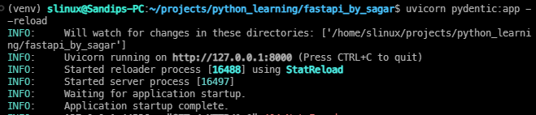
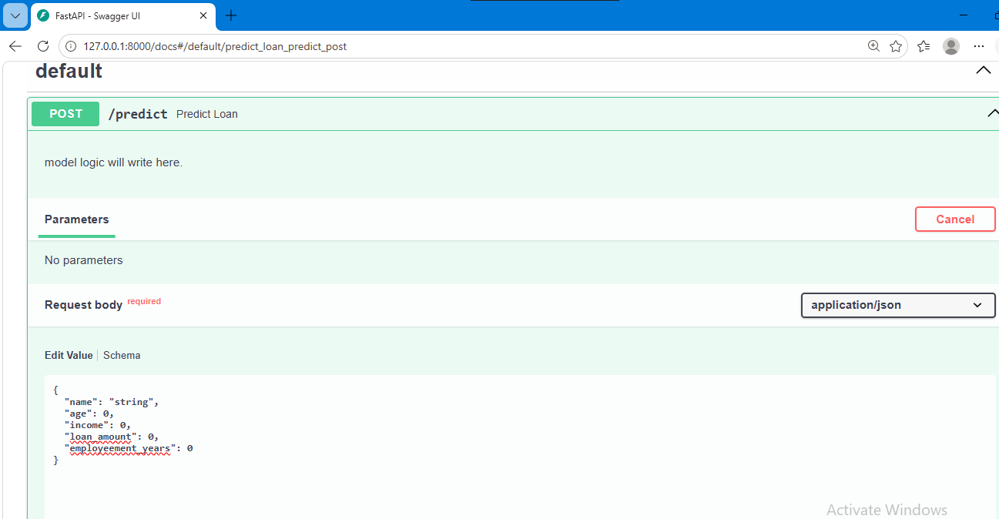

# Phase 4 Request Body.

- As an example whenever we apply for the loan in the bank we got a **form** to fillup.

1. there in the place of name we have to type name.
2. in the place of the age we can't type the amount but we type our age.
3. some of the parts are important and mandatory and we can't skip it and submit the form.
4. these al type of handling can be done using the **Pydentic**.

- if let's say instead of name we enter any digit value then the prediction model will be crash. and can out for the company too.

- so for model prediction or any pupose further these type of form must be need to properly handleled

**pydentic will save us from all of the above problem.**

- So what it does is if we let's say enter loan amount 50000 then. it will verify it that it's int or not if not then it will not sent it further.

**`pydentic.py`**

```python
from fastapi import FastAPI
from pydantic import BaseModel

app = FastAPI()

# this class is our form. here we are expecting our data which is coming to be in the specific datatype
class LoanApplication(BaseModel):
    name: str
    age: int
    income: float
    loan_amount: float
    employeement_years: int

@app.post("/predict")
def predict_loan(application: LoanApplication):
    """
    model logic will write here.
    """
    approved = (
        application.income > 50000 and
        application.employeement_years > 2 and 
        application.age >= 21
    )

    return {
        "applcation name": application.name,
        "loan_amount": application.loan_amount,
        "decision":"approved" if approved else "rejected",
        "review_income": application.income
    }
```





## Rules.

- Never trust on the input data even it's passed the validation.
    - like if we are having a person age of 25 and entered the amount of 9999999999999999. so it will pass the datatype thing. but that's an invalid data because why he needs loan then.
- so for this type of purpose we have also specify more things along with the data type like as example **Range of Income** and many more thing.

 